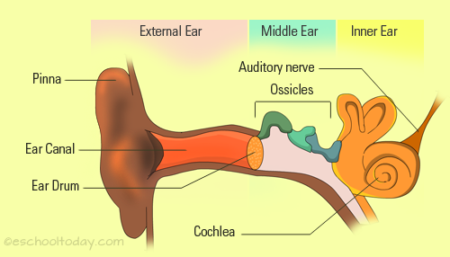
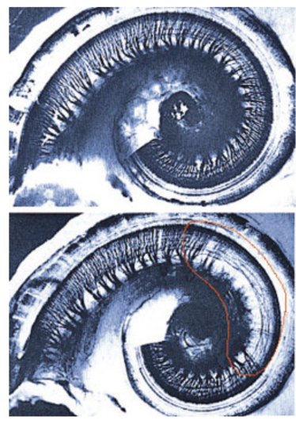
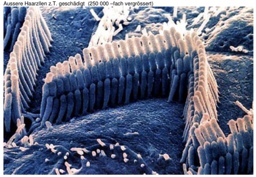

<!-- ---  
title: Music Computing
author: Angela Brennecke
affiliation: Film University Babelsberg KONRAD WOLF
date: Summer term 20
---   -->
**Music Computing - Summerterm 20**

Prof. Dr. Angela Brennecke | a.brennecke@filmuniversitaet.de | Film University Babelsberg *KONRAD WOLF*

--- 

# Important Notes -- Take Care of Your Ears!

When working with sound and audio equipment, please be specifically carefuly of your ears. Your hearing capabilities are extremeley important and must not get hurt!

## Hearing Organ

The following illustration represents your hearing organ.

  
*Image source: https://eschooltoday.com/science/the-five-senses/the-sense-of-hearing.html*

This [interactive ear guide](https://www.amplifon.com/uk/interactive-ear/index.html) illustrates the organic hearing process.

## Hearing Damage

If the sound waves that hit your ear drum are too loud, your inner ear and in particular the hair cells of the cochlea, can be damaged. The following images show functioning and damaged hair cells. 

  
*Image source unknown.*

  
*Image source unknown.*

Apart from the hair cells, loud noise that is too loud can also damage your ear drum and ossicles. Therefore, please turn down the volume and be very careful of your ears!
