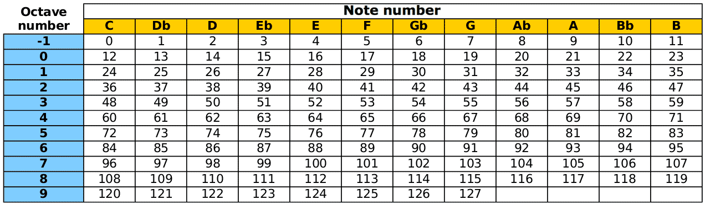
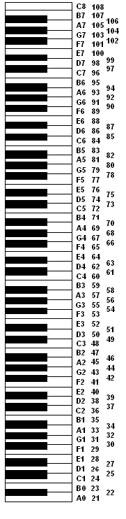
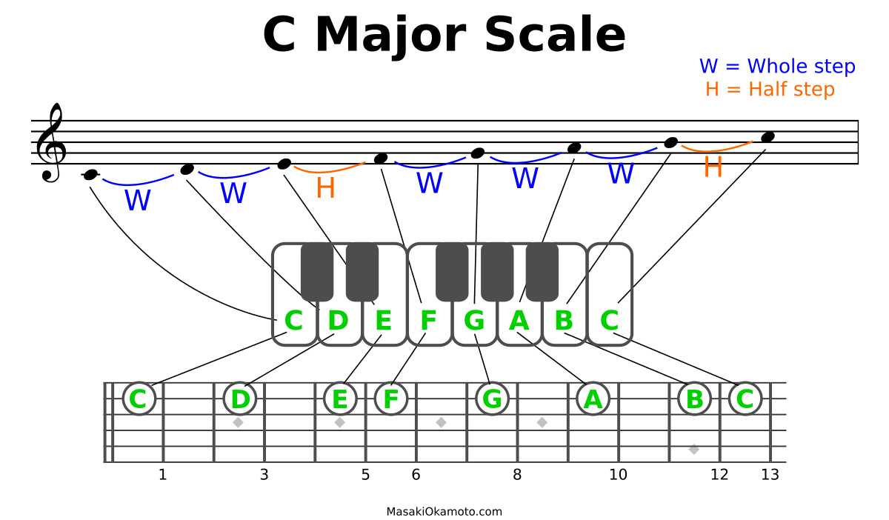

<!-- ---  
title: Music Computing
author: Angela Brennecke
affiliation: Film University Babelsberg KONRAD WOLF
date: Summer term 20
---   -->
**Music Computing - Summerterm 20**

Prof. Dr. Angela Brennecke | a.brennecke@filmuniversitaet.de | Film University Babelsberg *KONRAD WOLF*

--- 

- [What is Computer Music?](#what-is-computer-music)
- [Introduction to Sonic Pi](#introduction-to-sonic-pi)
  - [Interface](#interface)
  - [Play Command](#play-command)
  - [MIDI Notes vs Note Names](#midi-notes-vs-note-names)
- [Melody, Chords and Songs](#melody-chords-and-songs)
  - [Scales](#scales)
  - [Melody](#melody)
  - [Chords](#chords)
  - [Songs](#songs)
- [Notes on Ruby and Sonic Pi](#notes-on-ruby-and-sonic-pi)
  - [Symbols / Colon variables](#symbols--colon-variables)
  - [Data Structures](#data-structures)
  - [Methods](#methods)
- [Practical Exercises](#practical-exercises)
  - [Exercise 1](#exercise-1)
  - [Exercise 2](#exercise-2)
  - [Exercise 3](#exercise-3)
  - [Exercise 4](#exercise-4)


# What is Computer Music?

<!-- - [SuperCollider](https://supercollider.github.io)
- Jack Audio Kit -->

[Live coding with Sonic Pi](https://www.youtube.com/watch?v=G1m0aX9Lpts)

# Introduction to Sonic Pi

According to [mehackit](http://sonic-pi.mehackit.org/exercises/en/01-introduction/01-introduction.html), 

> Sonic Pi is an open-source programming environment, designed to explore and teach programming concepts through the process of creating new sounds. It’s a free live coding synth for everyone created by Sam Aaron at the University of Cambridge Computer Laboratory. You can use Sonic Pi to program, compose and perform in classical and contemporary styles ranging from Canons to Dubstep.

Sonic Pi has been developed for kids to learn how to program as well as to get a different view on music. Sonic Pi can also be used by professional musicians to create music as well as to do live coding. What we will explore first, is the user interface and the very basic commands.

Sonic Pi is based on the [ruby language](https://ruby-doc.org). You can use ruby to code your music. Find the most fundamental ruby functions in the accompanied [code folder](../code/ruby_language_nutshell/).


## Interface

- User interface 
- Editor windows
- Documentation and help window
- Device parameters and preferences

Learn the [Sonic Pi shortcuts](https://sonic-pi.net/tutorial.html#section-B-1) to be more efficient.


## Play Command

- "play" command
  - Play a note at a time
  - Play numerous notes simultaneously 
  - Play command calls inbuilt synths
- "sleep" command
  - Add a "pause" to the sequence of notes
  - Create melody

See also this [tutorial](https://www.youtube.com/watch?v=DkbEWmg6oI0&list=PLaitaNxyd8SHvTQjRGnMdKLsARXW7iYyp&index=2).

## MIDI Notes vs Note Names

[MIDI notes](https://www.inspiredacoustics.com/en/MIDI_note_numbers_and_center_frequencies) range from 0 to 127 and represent classical letter  names used for musical notes as depicted here:


*Image source: https://sonic-pi.mehackit.org/exercises/en/01-introduction/02-play-a-melody.html*


```ruby

play 60      # == C4
sleep 0.25
play D6      # == 86
sleep 0.25
play A3      # == 57

```

This image relates the letter name keys to the piano keyboard and their corresponding Midi notes:

  
*Image source: https://usermanuals.finalemusic.com/Finale2012Mac/Content/Finale/MIDI_Note_to_Pitch_Table.htm*


In Sonic Pi, you can use Midi notes or letter name notes to describe the note that you want to play back. As a programmer, you might also think about using **variables** instead of working with the note names directly:


```ruby

# Play calls inbuilt synths and plays a note
# 60 == C4
# 62 == D4 ....

mynote = "C4"
# mynote = 60

play mynote, amp: 2
play 62 + 2 + 4

```

```ruby

# To display the content of a variable use
puts mynote
print mynote

```


**Helpful Links**

- This [Sonic pi tutorial](https://www.youtube.com/watch?v=Yy00YaAfFTA&list=PLaitaNxyd8SHvTQjRGnMdKLsARXW7iYyp&index=3).  
- Midi vs letter name notes on the keyboard [web app](https://computermusicresource.com/Keyboard.Notes.html).   


# Melody, Chords and Songs

Music is strongly based on the harmonic (or disharmonic) interplay of **melody** and **chords**. Melody and chords are usually closely related through **scales**. 

## Scales 

**A scale** is an ordered sequence of tones, the ordering being determined by the scale. In this context, it is important to understand the notion of an interval. 
An interval is the "distance" or "difference" between two tones or to be more precise the ratio of their frequencies. The octacve is a natural interval that forms the basis of the musical system. Tones that are an octave apart sound equivalent but at a different pitch. All tones within the range of one octave are the basis for any kind of scale. 
Most prominent examples of scales in Western music are 

- Major scale (major third and major seventh)
- Minor scale (minor third and minor seventh)


The different intervals are listed below:

1) Root (unison)
2) Second (minor, major)
3) Third (minor, major)
4) Fourth 
5) Fifth 
6) Sixth (minor, major)
7) Seventh (minor, major)
8) Octave / Root one octave higher

And the chromatic scale that is comprised of all half tone in one intervall steps looks like this:

0) Root
1) Minor second
2) Major second
3) Minor third
4) Major third
5) Fourth
6) Tritonus
7) Fifth
8) Minor Sixth
9) Major Sixth
10) Minor Seventh
11) Major Seventh
12) Octave

--- 

Both scales are depicted in the following images:

  
*Image source: http://www.masakiokamoto.com/wp-content/uploads/2015/05/C-Major-Scale.png*

  
*Image source: http://www.masakiokamoto.com/wp-content/uploads/2015/05/A-Minor-Scale.png*

---

In Sonic Pi, print all scale names with this command:

```ruby

puts scale_names

```

Check out the next code example to listen to the different scales Sonic Pi supports and implements. In the example, a major scale is created that starts at root note "60", and that spans over 4 octaves. The method call "tick" simply iterates over the scale in a sequential order:

```ruby

myScale = scale 60, :major, num_octaves: 4


loop do
  play myScale.tick, release: 0.1
  sleep 0.25
end

```

 Let's find out with an [interactive example](https://sonic-pi.mehackit.org/exercises/en/09-keys-chords-and-scales/01-piano.html).

## Melody

**Melodies** are often based on a certain scale but can be any kind of sequence of single notes.

```ruby

play 60      # == C4
sleep 0.25
play D6      # == 86
sleep 0.25
play A3      # == 57

```

## Chords

**Chords** are combinations of notes played back at the same time or - also - in a sequential form as an **arpeggio** or **broken chord**. Chords are built based on the individual notes of a specific scale, for example, the major scale or the minor scale. A chord is then built by simply stacking notes on top of each other in thirds:

- Root  1
- Third 3
- Fifth 5

Chords can then be further extended with 

- Seventh 7
- Ninth 9 (which is the second note of the next octave)
- Eleventh 11 (the fourth note of the next octave)
- Thirteenth 13 (the sixth note of the next octave)

If you talk about chords in the context of scales, you usually do not refer to the scale of the chord but rather in which key it is, i.e., **major key** or **minor key**. 

- Major chord: 1, 3, 5
- Minor chord: 1, b3, 5 (contains a minor third)

```ruby

play 60      # == C4
play 64      # == E4
play 67      # == G4

```

```ruby

play chord(:D, :minor) # method call of the method "chord"
sleep 0.25
play chord(:A5, :major)

puts chord_names 

```

**Chord progressions** are commonly (or uncommonly) used sequences of chords that can make up a song. In Western music, there are certain chord progressions that are used very often because they create an interplay of tension and release that is particularly well perceived. 

[Here are some popular progressions listed.](https://sonic-pi.mehackit.org/exercises/en/09-keys-chords-and-scales/01-piano.html)


To create a repeating pattern of chords or single notes, you can use loops in Sonic Pi.

```ruby

4.times do
  4.times do
    play :C4
    sleep 0.25
  end
  play chord(:D, :minor)
  sleep 0.5
  play chord(:G, :major)
  sleep 0.5
end


loop do
  play :C4
  sleep 0.25
end

```

See also  
- [tutorial (mehackit)](https://sonic-pi.mehackit.org/exercises/en/01-introduction/03-loop-a-melody.html)
- [tutorial (youtube)](https://www.youtube.com/watch?v=QoeS_fgA2Jw&list=PLaitaNxyd8SHvTQjRGnMdKLsARXW7iYyp&index=7)


## Songs

**Songs** - as you will know - are simple or more complex compositions that often use melodies, chords and rythmic elements like beats that follow a specific of free-floating structure. In Western pop music, you will often find these types of components in a song:

- intro
- verse
- chorus
- bridge
- outro/end

In ruby, you can, for example, use methods to specify the components and play them back by calling the method names:

```ruby

# Global variable in ruby
$count = 0

testvar = play 67

# Method definition in ruby
def verse
  2.times do
    var = (scale :c3, :major)
    count = (inc count) # local variable!!
    count
    play var.pick
    sleep 0.2
   
  end
end


def intro
  
  puts $count
  play 56
end


# Super simple song

intro()
sleep 0.3
verse()
sleep 0.25
verse()

```

# Notes on Ruby and Sonic Pi 

## Symbols / Colon variables

[Ruby symbols](https://prismoskills.appspot.com/lessons/Ruby_by_example/Chapter_05_-_Colon_variable_in_Ruby.jsp) that use a colon in front of the variable name are used frequently in Sonic pi. These types of variables are similar to the enum type in C++. They cannot be assigned a value but rather they are like an enum constant. In Sonic Pi, symbols are used, for example, as hash keys that can be used to invoke a specific pattern or MIDI note:

```ruby

play :D4 #=> a symbol that will invoke the playback of MIDI note 62
sleep 0.25
play (scale :c3, :major) 

```

## Data Structures

Check the [ruby code examples](../code/ruby_language_nutshell) for how to create and use **an array** and a **hash data** structure. 

In Sonic pi, these data structures are complemented with the **ring** structure. Check out [the documentation for the data structures](https://sonic-pi.net/tutorial.html#section-8) used in Sonic pi and look into the ring data structure in particular. It is illustrated in this code example and implements an array whose elements can be accessed following an endless ring-like concept: 

```ruby

# Ring structure that is simply iterated using the tick method
# You can see the additional parameter "release" that is handed over
# to the play method. We will learn about the additional parameters
# later on. release is used to specify how long the note will be played back. 

loop do
  play (ring 60, 62, 64, 65, 67, 69, 71, 72).tick, release: 0.1
  sleep 0.25
end

```

## Methods 

A typical ruby method with parameters:
```ruby

# Method "repeat" has two method parameters "word" and "times"
def repeat( word, times ) 
    puts word * times
end

```

A typical method call in ruby with arguments. Compare with the chord commands ("methods") from above!

```ruby

# There are two ways to call the methods
repeat("Hello! ", 3) # => Hello! Hello! Hello!
repeat "Goodbye! ", 4 # => Goodbye! Goodbye! Goodbye! Goodbye!

```

Methods can also return a value in ruby:
```ruby
def hello
    return "Hello, world!"
end
```

# Practical Exercises

Check out some of the Sonic Pi examples in the first session folder in the code folder.

## Exercise 1
Open Sonic Pi and play with the introduced commands to playback notes, chords, and simple loops. Also, check out the documentation and in particular the following commands:

- clear
- play_pattern
- play_pattern_timed
- shuffle
- use_bpm
- tick
- choose

Try to create a few melodies using one or more of these function calls.

For example:
```ruby

use_bpm 130

play_pattern (ring 56, 67, 89)
# or
play_pattern [56, 67, 89]

```

Also, take a look at the different scales that you can use with Sonic Pi:

```ruby

myScale = scale 60, :major, num_octaves: 4

use_bpm 65

loop do
  play myScale.tick, release: 0.1
  #play myScale.choose, release: 0.1
  sleep 0.25
end

```


See also the [section on data structures](https://sonic-pi.net/tutorial.html#section-8) used in Sonic pi.

## Exercise 2

Now try to work with chords and chord progressions. Check out the common chord progressions in major and minor from [this site](https://sonic-pi.mehackit.org/exercises/en/09-keys-chords-and-scales/01-piano.html) and create a loop for each chord progression. How do you perceive the different progressions?
 
```ruby

loop do
  play chord(:D, :minor)
  sleep 0.5
  play chord(:G, :major)
  sleep 0.5
end

```
## Exercise 3
Try to change the sound of the synth you use by adding the "use_synth" command and check out this code example:

```ruby

use_synth :chipbass

4.times do
  
  play (scale :c3, :minor).tick
  sleep 0.25
end

```
Here, you can also use the "scale" command in conjunction with a specific root note (C3) and key (minor). Use the documentation of Sonic Pi to learn about the 

- the "scale" command
- the "ring" data structure and finally
- the "tick" command 

## Exercise 4

Pick a song that you like that has a decisive melody and try to figure our the sequence of notes. To figure out the very first (or all) note(s), use this [piano](https://sonic-pi.mehackit.org/exercises/en/09-keys-chords-and-scales/01-piano.html) or this [piano](https://www.apronus.com/music/flashpiano.htm).

Here are some further examples:

- Twinkle, twinkle, little star (starts with "Db4")
- [Hänschen klein](https://www.lieder-archiv.de/haenschen_klein-notenblatt_300727.html) (starts with "C4")
- [The White Stripes](https://www.youtube.com/watch?v=0J2QdDbelmY) (starts with "E3")

Check out the file satisfaction_riff.rb in the code folder and listen to the [song on youtube](https://www.youtube.com/watch?v=OZ8GZ3PFVGM). Try to figure out the riff and change it such it sounds similar to the song.