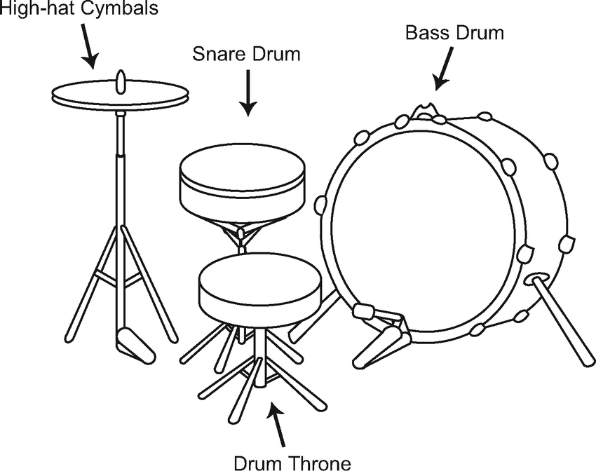
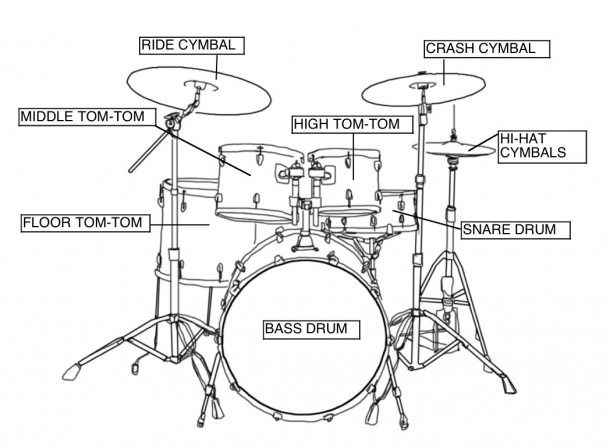

<!-- ---  
title: Music Computing
author: Angela Brennecke
affiliation: Film University Babelsberg KONRAD WOLF
date: Summer term 20
---   -->
**Music Computing - Summerterm 20**

Prof. Dr. Angela Brennecke | a.brennecke@filmuniversitaet.de | Film University Babelsberg *KONRAD WOLF*

--- 

- [Beats and Loops](#beats-and-loops)
  - [Rhythm, Beats and Groove](#rhythm-beats-and-groove)
  - [Drum Patterns](#drum-patterns)
  - [Practical Exercises](#practical-exercises)
    - [Exercise 1](#exercise-1)
    - [Exercise 2](#exercise-2)
    - [Exercise 3](#exercise-3)
- [Live Loops](#live-loops)
  - [Live Loops and Threads](#live-loops-and-threads)
  - [Syncing Live Loops](#syncing-live-loops)
  - [Practical Exercises](#practical-exercises-1)
    - [Exercise 1](#exercise-1-1)
    - [Exercise 2](#exercise-2-1)


# Beats and Loops

## Rhythm, Beats and Groove

Next to harmony and melody, **rhythm** is another essential ingredient of a music composition that specifies where and how to put an emphasis on in your song. Rhythm is usually a repeating pattern that relates strong and weak musical elements together. The arrangement results in a certain musical **groove** in particular in combination with the other instruments that you use. 

In electronic music, you will often simply talk about the **beats** that you add to your composition. (Drum) beats (often together with a bass line) are the central elements of rhythm. They are arranged following a certain rhythmic pattern (3/4, 4/4, 5/4, ...) and form the underlying rhythm of the song.

Let's check out this [interactive example](https://musiclab.chromeexperiments.com/Rhythm/) first.

## Drum Patterns

In order to build a rhythm with Sonic pi, it can be helpful to understand the usual setup of a drum kit as depicted in the following to images:


*Image source: https://www.researchgate.net/profile/Kazutoshi_Kudo/publication/259730940/figure/fig1/AS:483367935320064@1492255304784/Schematic-of-drum-kit-setting.png*


*Image source: https://i.pinimg.com/originals/4a/20/7c/4a207cf5dd823b9225e49207a72ef363.jpg*

---

In Sonic Pi, so far you have been using synths to play back melody and chords. Now, you will use **samples**, pre-recorded audio files, in order to build a first 4/4 beat like this:

```ruby

use_bpm 120

loop do
  sample :drum_heavy_kick # the sample command plays back pre-recorded audio
  sleep 1
  sample :drum_snare_hard
  sleep 1
  sample :drum_heavy_kick
  sleep 1
  sample :drum_snare_hard
  sleep 1
  
end

```

This beat simply uses a kick drum and a snare drum to represent a 4/4 pattern. The rhythm is quite stiff and machine-like. In order have it groove or swing a little more, you might want to work with slight variations of the pause time. This can, for example, be achieved with the **rrand** method: 


```ruby

use_bpm 120

loop do
  sample :drum_heavy_kick
  sleep rrand(0.9, 1)
  sample :drum_snare_hard
  sleep 1
  sample :drum_heavy_kick
  sleep 1
  sample :drum_snare_hard
  sleep 1
  
end

```

The variation adds a little human touch to the rhythm. 

Now let's take a listen to 10 very fundamental types of drum beats and rhytmic patterns:

- https://beatsure.com/common-drum-beats/

In case you want to learn more about drum programming for electronic music, not necessarily with Sonic Pi, [this website](https://www.edmprod.com/drums-guide/) looks like a good entry point in terms of musical concepts.

## Practical Exercises

### Exercise 1

Your turn is to code some drum patterns with Sonic Pi. Check out the session_02 folder in the code folder for the above mentioned examples. Now re-listen to the different drum patterns presented on beatsure.com. 

- Pick up to three patterns and try to transfer them into a Sonic Pi patch. 
- Check out the samples that start with "drum_" for this task.

### Exercise 2

In order to improve the variation of your beat, you might change some of the parameters that can be added to the sample command like, for instance, the **amp** and **pan** parameters:

- amp command can be used to amplify or lower the beat's volume (default value is 1) 
- pan command can be used to position the audio object in the stereo image, i.e., ranging from left (-1) over center (0) to right (1)

as illustrated in this code example:

```ruby

use_bpm 120

loop do
  sample :drum_heavy_kick, amp: 1, pan: 0
  sleep rrand(0.9, 1)
  sample :drum_snare_hard, amp: 0.5, pan: -0.75
  sleep 1
  sample :drum_heavy_kick, amp: 0.5, pan: 0
  sleep 1
  sample :drum_snare_hard, amp: 0.25, pan: 0.75
  sleep 1
  
end

```

### Exercise 3

Checkout this [video tutorial](https://www.youtube.com/watch?v=K5jBwmjOsNQ&list=PLaitaNxyd8SHvTQjRGnMdKLsARXW7iYyp&index=10) on the Sonic Pi song "Haunted Bells" by Sam Aaron. 

In this example, you will learn about a new parameter that can be used to adjust the sample rate called "rate".

Did you have any problem understanding the code? 
Did it bring you any new input or insight into your Sonic pi patches so far?


# Live Loops

Live loops allow you to playback different musical components at the same time and live loops allow you to change your code inside of the loop and re-start the playback without starting a new (additional) thread. The latter is in particular essential for Sonic Pi's **live coding** functionality.

Let's take a look at the following two code examples:

```ruby

use_bpm 120

loop do   # classical loop
  
  sample :drum_heavy_kick, amp: 1, pan: 0
  sleep rrand(0.9, 1)
  sample :drum_snare_hard, amp: 0.5, pan: -0.75
  sleep 1
  sample :drum_heavy_kick, amp: 0.75, pan: 0
  sleep 1
  sample :drum_snare_hard, amp: 0.25, pan: 0.75
  sleep 1
  
end

```

```ruby

live_loop :myBeat do  # live_loop called myBeat
  use_bpm 120
  
  sample :drum_heavy_kick, amp: 1, pan: 0
  sleep rrand(0.9, 1)
  sample :drum_snare_hard, amp: 0.5, pan: -0.75
  sleep 1
  sample :drum_heavy_kick, amp: 0.75, pan: 0
  sleep 1
  sample :drum_snare_hard, amp: 0.25, pan: 0.75
  sleep 1
  
end

```

Live loops always have to have a name, i.e., ":myBeat" which is required for the underlying implementation as you can see in the output window. 

If you played back the first example, a new thread would be generated in Sonic Pi per play back command. In contrast, if you played back the second example, only one thread would be created and played back per play back command. Let's take a look into Sonic Pi to understand the technical differences.


## Live Loops and Threads

As presented in the interactive example, live loops allow you to change the code inside of the live loop and to re-start the loop on the fly without having to stop the loop. This is in contrast with the normal "loop do .. end" and "x.times do .. end" commands. The reason for this behavior is as follows:

Whenever you restart one of those loops pressing the *Run button*, a new thread will be created. Hence, several calls to Run will lead to multiple threads that will be played back in parallel. With a live loop, only *one thread* will be created and will be evaluated and played back repeatedly. You can see this behavior logged in the protocol window of Sonic pi as well.

Apart from the concept of live loops, Sonic pi also supports to use and work with threads directly. See the [Sonic Pi tutorial/documentation on threads](https://sonic-pi.net/tutorial.html#section-5-4) for further information on how to use threads directly.


## Syncing Live Loops 

In order to mix a beat with a melody and harmony, it is necessary to playback both elements in parallel. In Sonic pi this can be achieved with the **live_loop** as well:

```ruby

live_loop :myBeat do
  use_bpm 120
  
  sample :drum_heavy_kick, amp: 1, pan: 0
  sleep rrand(0.9, 1)
  sample :drum_snare_hard, amp: 0.5, pan: -0.75
  sleep 1
  sample :drum_heavy_kick, amp: 0.75, pan: 0
  sleep 1
  sample :drum_snare_hard, amp: 0.25, pan: 0.75
  sleep 1
end

live_loop :myMelody do
  
  sync :myBeat # start this melody right after the myBeat loop
  3.times do
    
    play 60
    sleep 0.75
    
  end
  #sleep 0.25
  
end

```

See also these tutorials on live loops
- [Live loop basics](https://www.youtube.com/watch?v=XIR8CSDHzNo&list=PLaitaNxyd8SHvTQjRGnMdKLsARXW7iYyp&index=27)
- [Live loop sync](https://www.youtube.com/watch?v=0pygsSuBSxc&list=PLaitaNxyd8SHvTQjRGnMdKLsARXW7iYyp&index=28)

Check also the [Sonic Pi tutorial/documentation on live coding](https://sonic-pi.net/tutorial.html#section-9) which provides some further examples on how to use live loops-


## Practical Exercises

### Exercise 1 

Guess what: Return to what you have previously coded and combine your beat with your melody and/ or harmonic chord progression. Play around with the concept of live loops and create on example that combines a beat with a melody and chord progression. Make sure that your melody is synced.

Check also this [tutorial](https://www.youtube.com/watch?v=4x7RXApCu6s) which is a complex example on creating a jazz tune with live loops in Sonic pi.

### Exercise 2

Practice with your example and come up with a small idea for live coding. Just play around with your composition so that you can present it to the group.