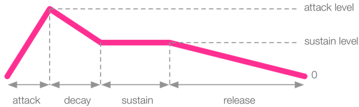

<!-- ---  
title: Music Computing
author: Angela Brennecke
affiliation: Film University Babelsberg KONRAD WOLF
date: Summer term 20
---   -->
**Music Computing - Summerterm 20**

Prof. Dr. Angela Brennecke | a.brennecke@filmuniversitaet.de | Film University Babelsberg *KONRAD WOLF*

--- 

- [Tweaking Sounds](#tweaking-sounds)
- [Synthesis vs Sampling](#synthesis-vs-sampling)
  - [Sound Parameters](#sound-parameters)
    - [Audio Envelopes](#audio-envelopes)
      - [Synthesis Envelopes](#synthesis-envelopes)
      - [Sampling Envelopes](#sampling-envelopes)
    - [Further Sound Parameters](#further-sound-parameters)
  - [Practical Exercises](#practical-exercises)
    - [Example 1](#example-1)
    - [Example 2](#example-2)
- [FX](#fx)
  - [Practical Exercises](#practical-exercises-1)
    - [Example 1](#example-1-1)

# Tweaking Sounds

Let us start with a few music examples:

- [David August](https://www.youtube.com/watch?v=cwL_CIhS9Qs)
- [Christian Löffler](https://www.youtube.com/watch?v=OijrlItssOc)
- [Alfa Mist](https://www.youtube.com/watch?v=BVO_R8uvMhE)

Listen carefully to the examples and jot down what you notice in terms of melody, chord, song structure, whatever.


# Synthesis vs Sampling

With Sonic Pi, it is also possible to change the synths as well as the sample sounds themselves which is really getting into the two different fields of **sound synthesis** and **sampling**. The former is generally about creating or rather synthesizing new sounds algorithmically with the help of a computer. The latter is about using, editing and modifying pre-recorded samples with the help of a computer in order to create new sounds. 

In Sonic Pi, synthesis and sampling is supported by changing the sound parameters of the sounds you load with the **play** and **sample** commands. 


## Sound Parameters

### Audio Envelopes

One essential aspect of tweaking sounds in this context is the ADSR envelope which is used to shape the sound's *timbre*. ADSR means

- **attack**: time from 0 amplitude to the attack_level (by default attack level equals 1),
- **decay**: time to move amplitude from attack_level to decay_level,
- **sustain**: time to move the amplitude from decay_level to sustain_level,
- **release**: time to move amplitude from sustain_level to 0

These terms and their meaning in the context of shaping sounds is illustrated in the following image:


*Image source: Sonic pi documentation*

The ADSR envelope allows you to control the duration as well as the amplitude of a sound that you want to play back. The values that you can specify for attack, decay, sustain and release are time values in seconds. 

#### Synthesis Envelopes

By default every synth in Sonic Pi has a **total playback time of 1 second**. The attack parameter is set to 0, i.e., hits an amplitude of 1 immediately. The release parameter is set to 1 second, and the decay and sustain parameters are both set to 0 seconds as well.


```ruby

play 60, attack: 0, decay: 0, sustain: 0, release: 1 # default playback parameters for any synth

```

Whenever you want to specify the envelope parameters manually, you can freely adjust the parameters. In addition to the duration of each parameter, you can also adjust the level per parameter. Check out the following two examples:

```ruby

live_loop :test do
  play 60, attack: 0.2, decay: 0.3, sustain: 2, release: 0.2
  sleep 4
end

```

```ruby

play 60, attack: 0.1, attack_level: 1, decay: 0.2, sustain_level: 0.4, sustain: 1, release: 0.5

```

#### Sampling Envelopes

If you work with samples instead of synths, the duration is generally depending on the sample file that you use. Here, Sonic Pi sets the values differently and as described in the Sonic Pi documenation on [Enveloped Samples](https://sonic-pi.net/tutorial.html#section-3-4):

> Where the ADSR envelope’s behaviour differs from the standard synth envelope is in the sustain value. In the standard synth envelope, the sustain defaulted to 0 unless you set it manually. With samples, the sustain value defaults to an automagical value - the time left to play the rest of the sample. This is why we hear the full sample when we pass no defaults. If the attack, decay, sustain and release values were all 0 we’d never hear a peep. Sonic Pi therefore calculates how long the sample is, deducts any attack, decay and release times and uses the result as your sustain time. If the attack, decay and release values add up to more than the duration of the sample, the sustain is simply set to 0.  

In order to set the envelope for samples, it will thus be helpful to find out how long the sample actually is. This can be achieved using the sample_duration command:

```ruby

print sample_duration :loop_amen

```

Now that you know how long a sample is, you can either work with the information programmatically or manually, i.e., by simply using the printed information and setting the parameters directly.

```ruby

sample :loop_amen, attack: 0.75, release: 0.75

```

Alternatively, you might want to use a variable to keep things more flexible:

```ruby

# you might as well store this information in a variable ... 
duration = sample_duration :loop_amen 

# ... and use it in the code like this
sample :loop_amen, attack: (duration / 2), release: (duration / 2)

```

See also this documation on [duration with envelopes](https://sonic-pi.net/tutorial.html#section-2-4) and this documenation on [enveloped samples](https://sonic-pi.net/tutorial.html#section-2-4) for more information.

### Further Sound Parameters 

In the Sonic Pi help window you can find an overview of all synths and samples that are provided by Sonic Pi by default. Check out the different synths and sample groups to find out about the Sonic Pi library. 

With the synths packs, it is mostly envelope parameters that can be changed. There is however one other parameter that is of interest:

- cutoff
- mod_: modulation parameters

With the sample packs, there are many other parameters of interest. For example, check out the following parameters:

- amp
- pan
- rate
- start
- finish
- pitch

A very interesting functionality is provided by **onset** parameter. This option does a feature detection on the wave file and stores all significantly different features (mostly used with drum loops) in a list. You can pick from that list and create a unique sampled beat:

```ruby

live_loop :jungle do
 sample :loop_amen, onset: pick
 sleep 0.125
end

```

Some notes on onset from the Sonic Pi documentation: 

> In the 90s a number of music scenes burst out of new technology which enabled artists to take drum breaks like this apart and reassemble in a different order. [...] In this example we introduce a basic loop called :jungle which picks a random drum hit from our audio sample, waits for an eighth of a second and then picks another drum hit. This results in an endless stream of random drum beats to dance to whilst you experience what a loop is.


## Practical Exercises

### Example 1

### Example 2


# FX

## Practical Exercises

### Example 1

Check out the coding example folder for session 02 